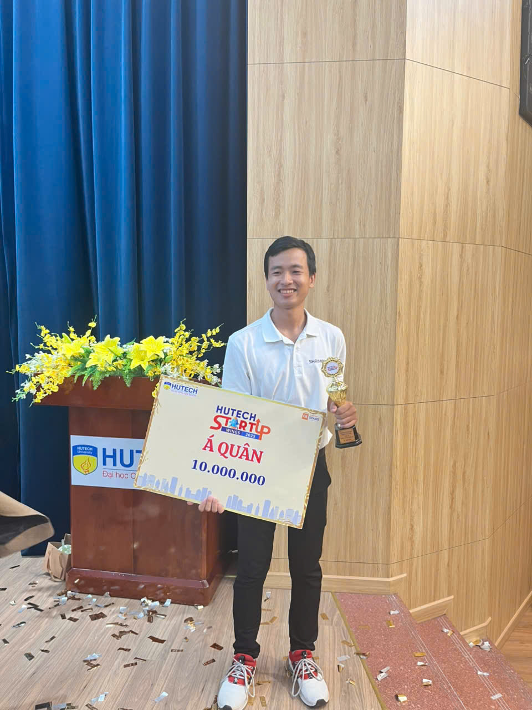
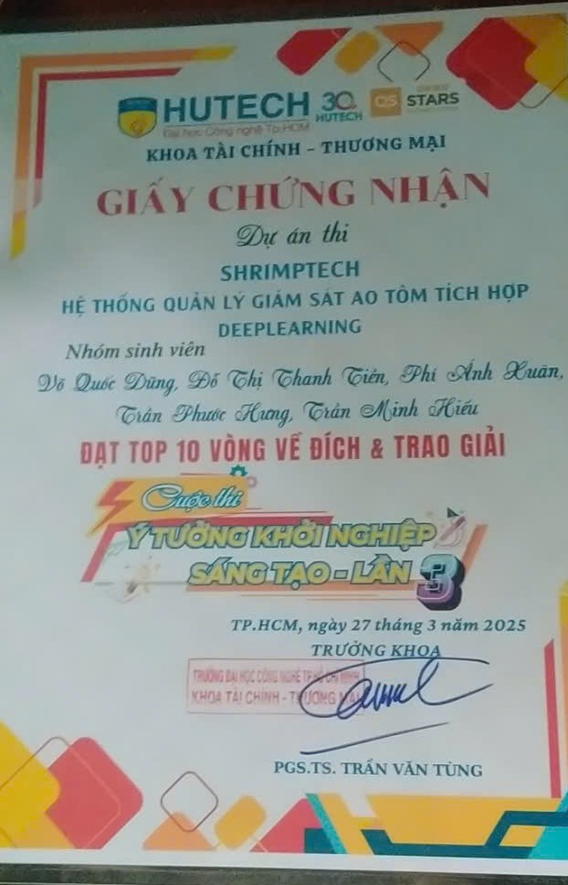
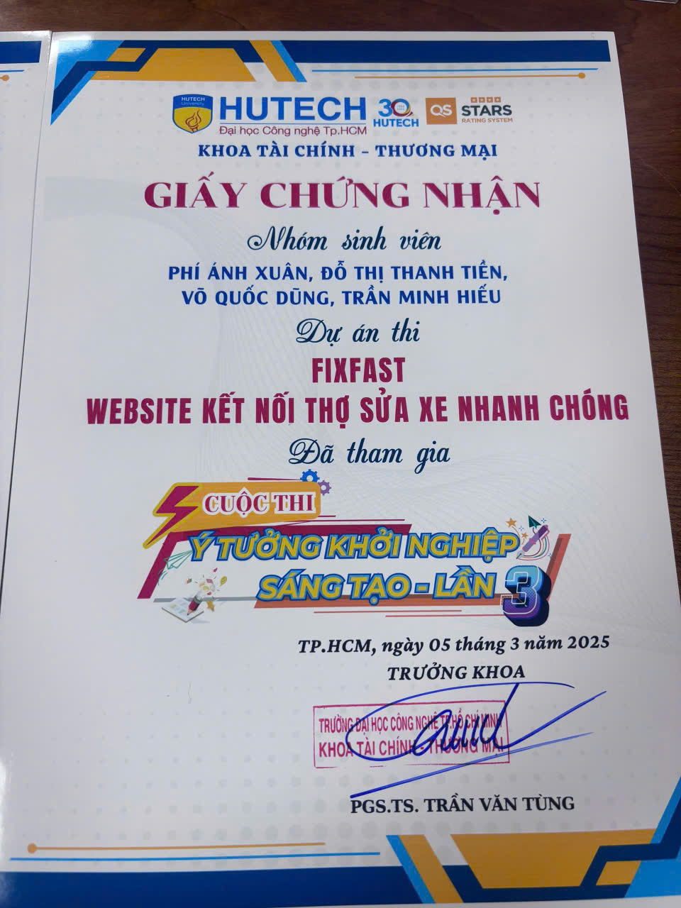
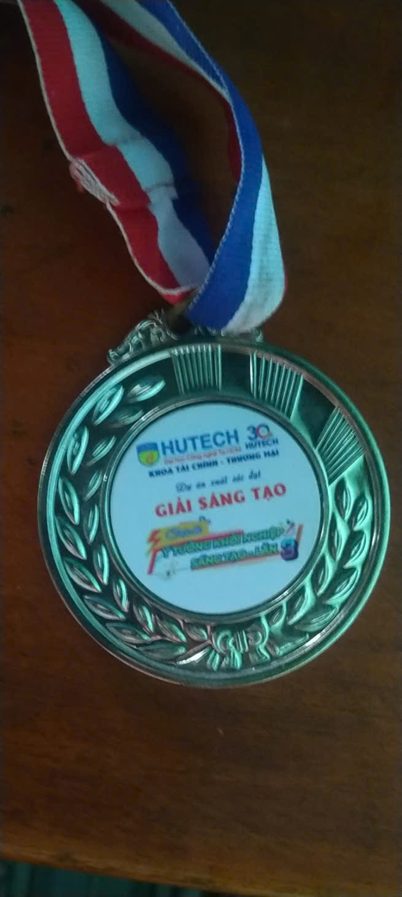
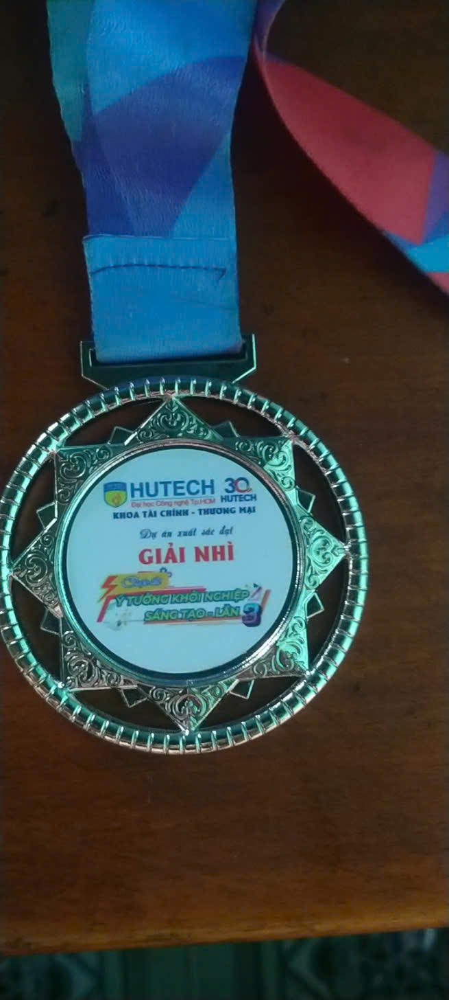
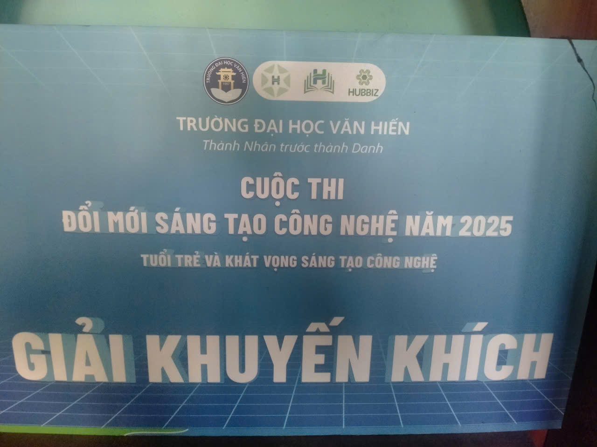
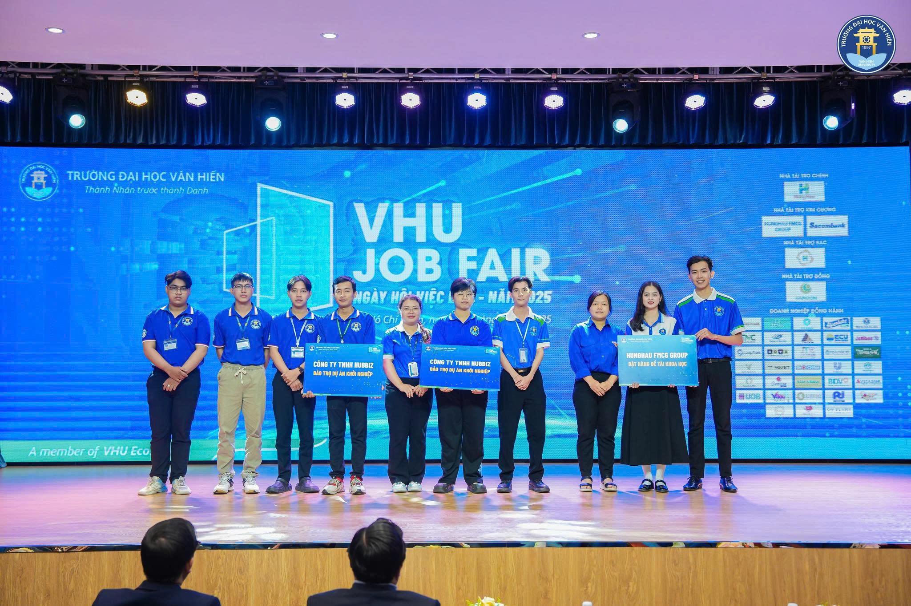
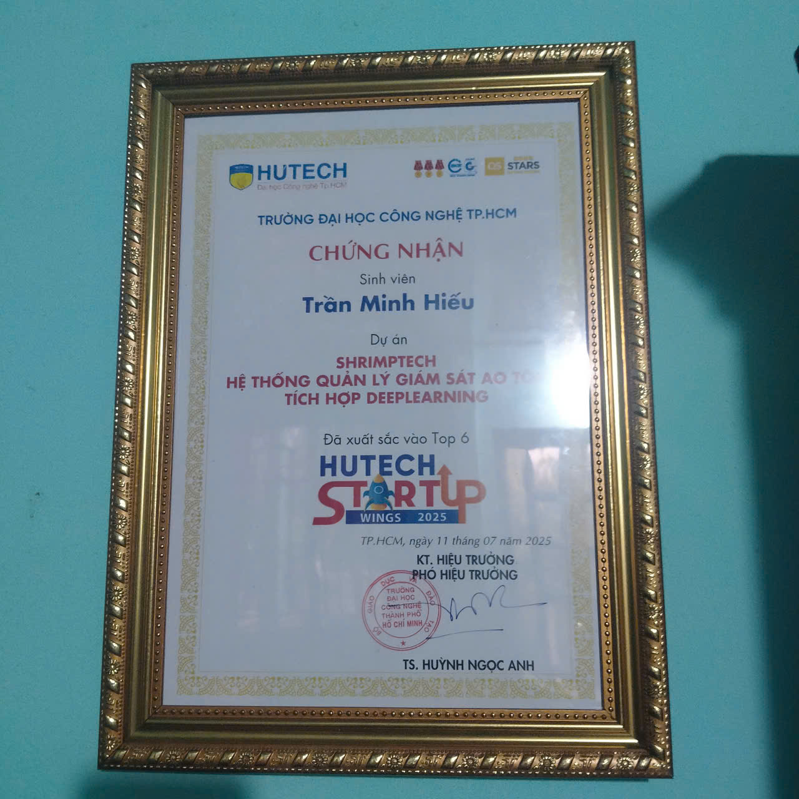

# 👋 Hi, I'm **Hieu Tran Minh**

🎯 **IoT Developer | Electronics Engineer | Agritech Innovator**

Building intelligent **sensor-to-cloud systems** for smart aquaculture 🦐

---

## 🚀 Featured Projects

| Project | Tech | Description |
|---------|------|-------------|
| 🌊 **[ShrimpTechWeb](https://github.com/minhhieu-2003/ShrimpTechWeb)** | JavaScript • HTML • CSS | Full-stack IoT platform - Real-time aquaculture monitoring & control |
| ⚙️ **[IoT-SystemDemo_App](https://github.com/minhhieu-2003/IoT-SystemDemo_App)** | C++ • ESP32 • FreeRTOS | Production firmware - Multi-sensor integration & cloud sync |
| 📱 **[ShrimpTechApp](https://github.com/minhhieu-2003/ShrimpTechApp)** | TypeScript • React Native | Mobile app - Device control & real-time monitoring |
| 🍃 **[app_IOT_demo_Raspberry-pi](https://github.com/minhhieu-2003/app_IOT_demo_Raspberry-pi)** | Node.js • TypeScript • MQTT | Edge gateway - Local data processing & cloud bridge |
| 📚 **[NCKH](https://github.com/minhhieu-2003/NCKH)** | C++ • C | Research - Smart aquaculture systems (VHU & HUTECH) |
| 🧠 **[Learn-PyTorch](https://github.com/minhhieu-2003/Learn-How-to-Build-PyTorch-Neural-Networks-from-Scratch)** | Python • PyTorch | Educational - Deep learning fundamentals |

---

## 💻 Tech Stack

**Frontend:** JavaScript • TypeScript • React • React Native • HTML • CSS  
**Embedded:** C++ • C • ESP32 • FreeRTOS • Arduino  
**Backend:** Node.js • Firebase • REST APIs  
**AI/ML:** Python • PyTorch • TensorFlow Lite  
**Tools:** Git • GitHub • EasyEDA • JLCPCB • VS Code  

---

## 📊 Language Distribution

```
TypeScript:     30.96%  🔵
C++:            13.57%  🔴
JavaScript:      8.25%  🟨
HTML:            3.66%  🔴
CSS:             2.28%  🟣
C:               0.20%  ⚪
Others:          0.52%  ⚪
```

**Total:** 6 repositories | 66 commits | 2 stars

---

## 🏆 Awards & Recognition (2025)

🥈 **2nd Prize** – HUTECH Startup Ideas (3rd consecutive)  
🧠 **Creative Innovation Award** – HUTECH University  
🚀 **Top 6** – HUTECH Startup Wings  
🏅 **Encouragement Award** – Van Hien University  
💼 **Startup Sponsorship** – HUBBIZ Co., Ltd.  

### 📸 Award Gallery

<p align="center">
  
</p>

<table>
  <tr>
    <td width="50%" align="center">
      <a href="awards/hutech_startup_runner_up.jpg">
        
      </a>
      <br/>
      <sub><b>🥈 HUTECH Startup Runner-up</b></sub>
    </td>
    <td width="50%" align="center">
      <a href="awards/award_2.jpg">
        
      </a>
      <br/>
      <sub><b>🏆 Achievement Certificate</b></sub>
    </td>
  </tr>
  <tr>
    <td width="50%" align="center">
      <a href="awards/award_3.jpg">
        
      </a>
      <br/>
      <sub><b>🎯 Recognition Award</b></sub>
    </td>
    <td width="50%" align="center">
      <a href="awards/award_4.jpg">
        
      </a>
      <br/>
      <sub><b>⭐ Excellence Award</b></sub>
    </td>
  </tr>
  <tr>
    <td width="50%" align="center">
      <a href="awards/award_5.jpg">
        
      </a>
      <br/>
      <sub><b>🌟 Innovation Prize</b></sub>
    </td>
    <td width="50%" align="center">
      <a href="awards/award_6.jpg">
        
      </a>
      <br/>
      <sub><b>💡 Creative Award</b></sub>
    </td>
  </tr>
  <tr>
    <td width="50%" align="center">
      <a href="awards/award_7.jpg">
        
      </a>
      <br/>
      <sub><b>🚀 Startup Achievement</b></sub>
    </td>
    <td width="50%" align="center">
      <a href="awards/award_8.jpg">
        
      </a>
      <br/>
      <sub><b>🎓 Academic Excellence</b></sub>
    </td>
  </tr>
</table>

<p align="center">
  
</p>

---

## 🎯 Focus Areas

✅ **IoT & Embedded Systems** – ESP32, FreeRTOS, sensor integration  
✅ **Smart Aquaculture** – Real-time monitoring, automated control  
✅ **Full-Stack Development** – Frontend, backend, hardware integration  
✅ **Edge AI & Computer Vision** – Disease detection, anomaly analysis  
✅ **Open-Source** – Community-driven sustainable agriculture solutions  

---

## 🔗 Connect

📧 **Email:** [minhhieutran691@gmail.com](mailto:minhhieutran691@gmail.com)  
💼 **LinkedIn:** [linkedin.com/in/minhhieu-tran-767b17396](https://linkedin.com/in/minhhieu-tran-767b17396/)  
🐦 **Twitter:** [@minhhieu_2003](https://twitter.com/minhhieu_2003)  
🌐 **Website:** [shrimptech.vn](https://shrimptech.vn)  

---

**📍 Vietnam** | 🎓 Van Hien University | 🔬 Smart Aquaculture Research  

> *"Innovation thrives where code meets sustainability."*
